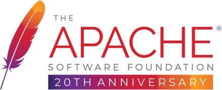

----

## Ones工具平台
### 平台简介：
##### 本项目构建初衷是结合近年若干项目使用的技术与经验，整理可为类似项目提供业务快速实现的自身共性的定制工具平台为目标，纯属个人实践积累总结与偏好。非基础工具包适合所有需求场景。

#### 温馨提示：使用前请确认业务场景与技术实现是否匹配。
1. 基于JDK17构建
2. 使用前认真阅读各模块下:README.md
3. 个人维护不定期更新

#### 核心依赖
- Spring Boot
- lombok
- hutool
- druid
- mybatis-plus
- ...

---
#### 模块目录
1. os-extra模块
   - os-extra-codegen【代码生成器】
   - os-extra-toolkit【模板邮件、流水号】
2. [os-starter模块](os-starter/README.md)【自定义starter供业务模块引入】
   - os-azure (暂停维护：最终版本V0.5.1)
   - os-core
   - os-http（扩展Web模块+redis模块）
   - os-log
   - os-mybatis
   - os-nlp
   - os-oss
   - os-redis
   - os-rocketmq
   - os-sms
   - os-task
   - os-web
   - os-wxmini
   - os-wxmp
3. [公共模块](os-common/README.md)
   - bom配置模块
   - core核心模块
   - http模块（扩展Web模块+redis模块）
   - log模块
   - mybatis模块
   - redis模块
   - task定时任务模块
   - web模块
4. [阿里模块](os-ali/README.md)
   - 自然语言-中文分词
   - 对象存储
   - 消息队列RocketMQ
   - 短信服务
5. [微信模块](os-wx/README.md)
   - 企业微信【待发布】
   - 小程序
   - 服务号
   - 微信支付【待发布】

---

#### Ones工具平台地址：
Gitee：[https://gitee.com/clarkstore/os-all](https://gitee.com/clarkstore/os-all)

GitHub：[https://github.com/clarkstore/os-all](https://github.com/clarkstore/os-all)

#### Os-Biz基础平台地址：
Gitee：[https://gitee.com/clarkstore/os-biz](https://gitee.com/clarkstore/os-biz)

GitHub：[https://gitee.com/clarkstore/os-biz](https://gitee.com/clarkstore/os-biz)

#### Os-Nacos微服务平台地址：
Gitee：[https://gitee.com/clarkstore/os-nacos](https://gitee.com/clarkstore/os-nacos)

GitHub：[https://gitee.com/clarkstore/os-nacos](https://gitee.com/clarkstore/os-nacos)

---
### 开源协议
遵循 [Apache 2.0 协议](https://www.apache.org/licenses/LICENSE-2.0.html) ，
允许商业使用，但务必保留类作者、Copyright 信息。

---
### 赞助商

[感谢JetBrains IDEA对开源项目的支持](https://jb.gg/OpenSource)